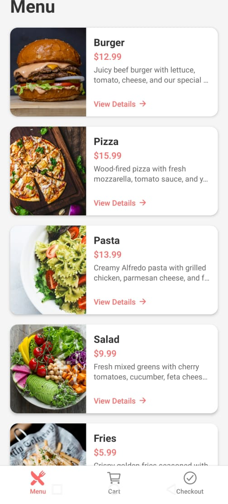
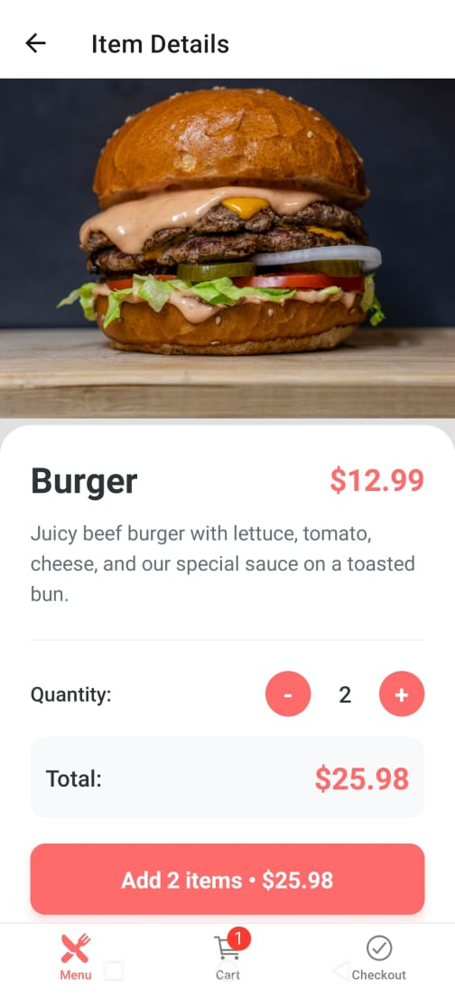
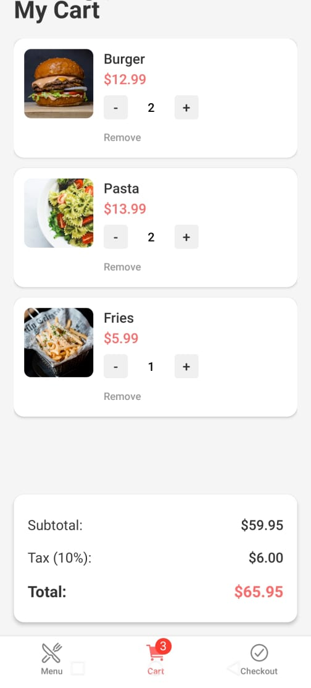
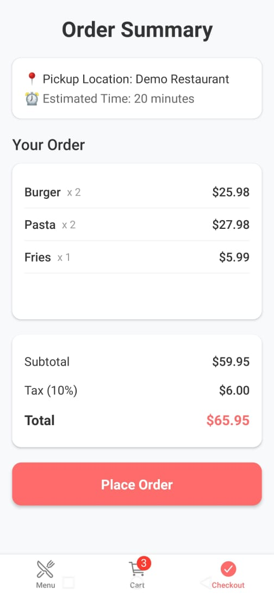
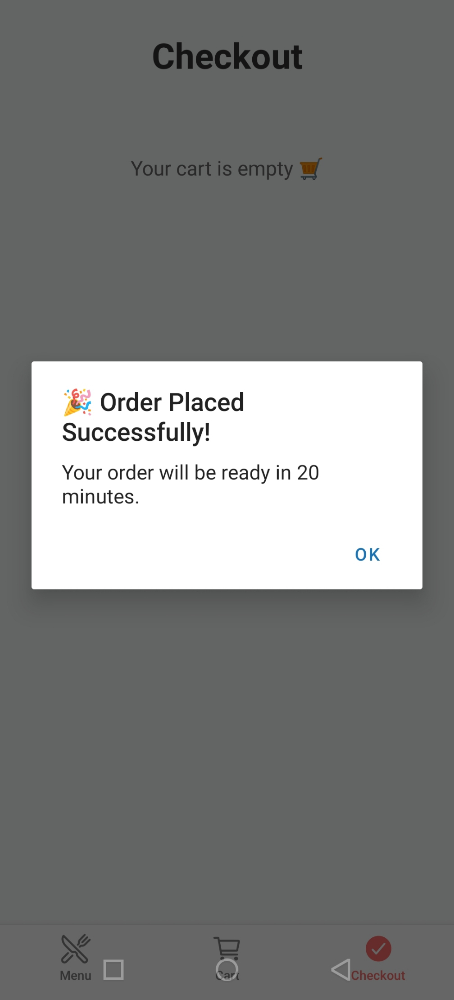

# Restaurant Ordering Demo (React Native)

A small mobile restaurant ordering app built with **React Native + Expo** to demonstrate rapid ramp-up with React Native while applying strong React fundamentals.

The app simulates a simple ordering flow where users can browse menu items, view product details, add items to a cart, and place an order.

---

## Tech Stack

- React Native
- Expo
- TypeScript
- React Navigation
- Zustand (state management)

---

## Features

- Login screen
- Menu browsing with pull-to-refresh
- Item detail screen with quantity selector
- Add to cart with toast notification
- Cart management (increase/decrease quantity, remove items)
- Checkout screen with order summary and pricing breakdown
- Order confirmation flow
- Cart badge showing number of items
- Empty cart states and loading indicators

---

## Navigation Structure

Login
↓
Tabs
├ Menu
│ └ Item Detail
├ Cart
└ Checkout

---

## Project Structure

src
├ components
├ screens
├ navigation
├ store
├ data
└ types

- **components** – reusable UI components  
- **screens** – main application screens  
- **navigation** – React Navigation setup  
- **store** – Zustand cart state management  
- **data** – mock menu data  
- **types** – TypeScript types  

---

## Running the Project

Install dependencies:

npm install

Start the development server:

npx expo start

Then open using **Expo Go** or an emulator.

---

## Demo Flow

Login → Browse Menu → View Item → Add to Cart → Cart → Checkout → Place Order

---

## 📸 Screenshots

**Login Screen**  

**Menu Screen**  

**Item Details**  

**Cart Screen**  

**Checkout - Order Summary**  

**Checkout - Confirmation**  

